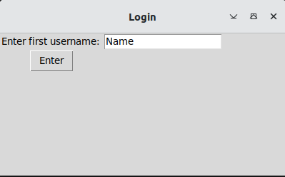
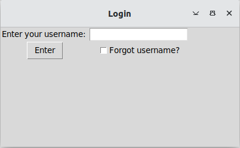
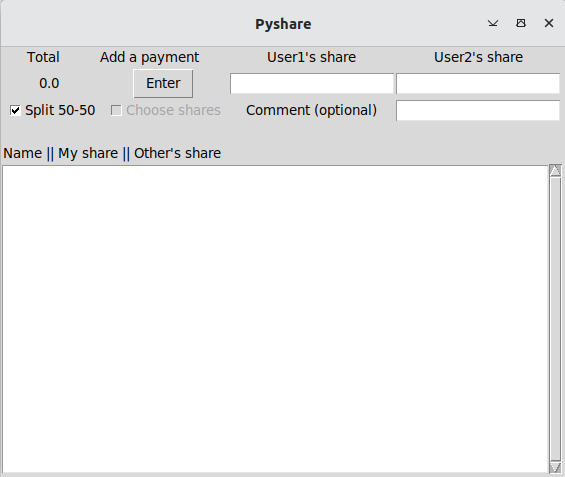
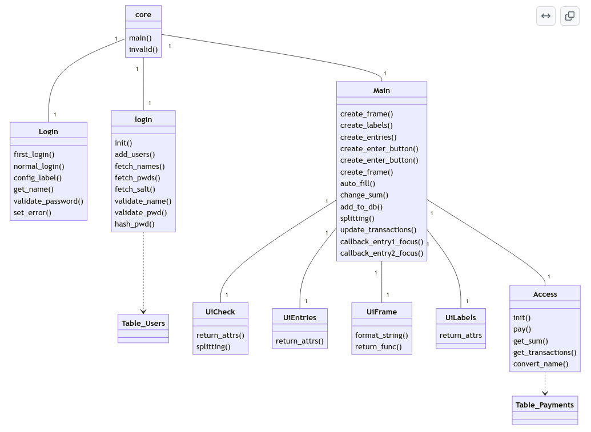
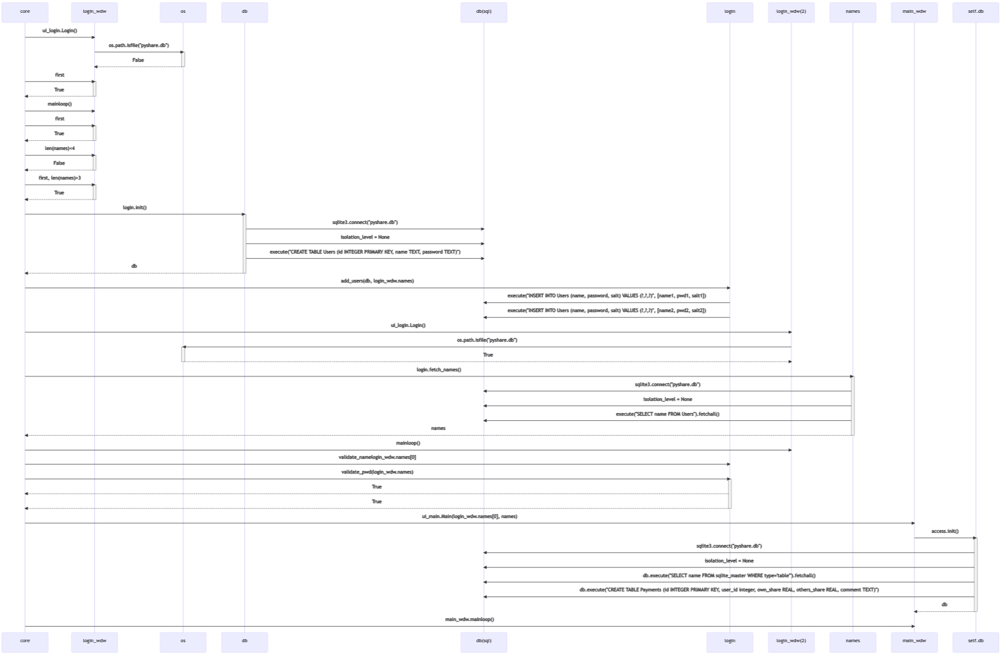

# Arkkitehtuurikuvaus

## Rakenne

Ohjelman pakkausrakenne on seuraava:

Kansio src sisältää ohjelman toimintaan liittyvät tiedostot.
Alla on kuvattu src kansion rakenne*.

```
src
 ├── core.py 
 ├── db
 │   ├── access.py
 │   └── login.py
 │
 └── ui
     ├── ui_login.py
     └── ui_main.py
```
\* Vain oleelliset tiedostot ja kansiot

Kansiosta src löytyy tiedosto core.py, joka vastaa sovelluslogiikasta.
Alikansiosta db löytyy tietokantoihin liittyät tiedostot access.py ja login.py. Kansiosta ui puolestaan löytyy käyttöliittyvään liittyvät tiedostot ui_login.py ja ui_main.py.

## Käyttöliittymä
&nbsp; <br>
**Uusien käyttäjien luonti** <br>
&nbsp; <br>

<br>
&nbsp; <br>
**Sisäänkirjautuminen** <br>
&nbsp; <br>

<br>
&nbsp; <br>
**Pääikkuna** <br>
&nbsp; <br>

<br>

Käyttöliittynä koostuu kolmesta eri ikkunasta, jotka ovat käytössä eri aikoihin. Ensimmäinen ikkuna on käytössä vain ensimmäisellä käyttökerralla, kun taas toinen ja kolmas ovat käytössä joka kerta.

## Sovelluslogiikka
&nbsp; <br>


<br>
&nbsp; <br>
Yllä on kuvattu sovelluksen rakennetta. Isolla alkukirjaimella alkavat nimet ovat luokkia ja pienellä alkavat luokattomia tiedostoja. Poikkeuksena ovat Table_-alkuiset tiedostot, jotka ovat SQL-tauluja.
&nbsp; <br>
&nbsp; <br>

&nbsp; <br>
Yllä on kuvattu sovelluksen ensimmäistä käyttökertaa pääohjelman (core.py) näkökulmasta. Voit klikata kuvaa avataksesi suuremman näkymän.
&nbsp; <br>


## Turvallisuus
&nbsp; <br>
Käyttäjien luomat salasanat tiivistetään (hashed) satunnaisen salt-bittijonon kanssa. Tiivistetty (hashed) salasana ja salt pidetään tallessa, ja näiden avulla voidaan turvallisesti tarkistaa käyttäjän henkilöllisyys. Vaikka ulkopuolinen taho pääsisi käsiksi tietokantaan, hän ei saa sieltä salasanoja. Lisäksi kirjautuessa sovellukseen ovat salasanat peitettyivä "*"-symboleilla, jotta kukaan ei pääse näkemään salasanaa ruudulta.
&nbsp; <br>
## Tallennus
&nbsp; <br>
Sovellus käyttää tietojen tallennuksen SQL-tietokantaa. Tietokanta jakautuu kahteen tauluun, josta ensimmäiseen tallennetaan käyttäjän id, nimi, tiivistetty (hashed) salasana ja salt. <br>
Toisesta taulusta löytyy referenssi käyttäjän id:seen, maksun osuudet käyttäjittäin, sekä vaihtoehtoinen kommentti maksuun liittyen.

