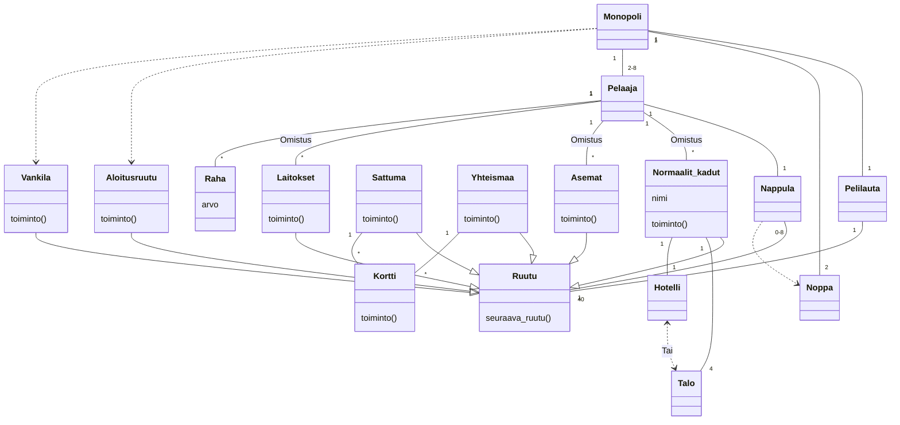

# Monopolin luokkavaavio

```mermaid
classDiagram
    Monopoli "1" -- "1" Pelilauta
    class Monopoli{
      }
    Pelilauta "1" -- "40" Ruutu
    class Pelilauta{
      }
    class Ruutu{
      seuraava_ruutu()  
      }
    Monopoli "1" -- "2" Noppa
    class Noppa{   
      }
    Monopoli "1" -- "2-8" Pelaaja
    class Pelaaja{  
      }
    Pelaaja "1" -- "1" Nappula
    class Nappula{   
      }
    Nappula "0-8" -- "1" Ruutu
    Nappula ..> Noppa
    Aloitusruutu --|> Ruutu
    class Aloitusruutu{
      toiminto()
      } 
    Vankila --|> Ruutu
    class Vankila{
      toiminto()
      } 
    Sattuma --|> Ruutu
    class Sattuma{
      toiminto()
      } 
    Yhteismaa --|> Ruutu
    class Yhteismaa{
      toiminto()
      } 
    Asemat --|> Ruutu
    class Asemat{
      toiminto()
      } 
    Laitokset --|> Ruutu
    class Laitokset{
      toiminto()
      } 
    Normaalit_kadut --|> Ruutu
    class Normaalit_kadut{
      nimi
      toiminto()
      } 
    Monopoli ..> Aloitusruutu
    Monopoli ..> Vankila
    Sattuma "1" -- "*" Kortti
    class Kortti{
      toiminto()
      }
    Yhteismaa "1" -- "*" Kortti
    Normaalit_kadut "1" -- "4" Talo
    class Talo {
      }
    Normaalit_kadut "1" -- "1" Hotelli
    class Hotelli {
      }
    Hotelli <..> Talo : Tai
    Pelaaja "1" -- "*" Normaalit_kadut : Omistus
    Pelaaja "1" -- "*" Asemat : Omistus
    Pelaaja "1" -- "*" Laitokset : Omistus
    Pelaaja "1" -- "*" Raha
    class Raha{
      arvo
      } 
```